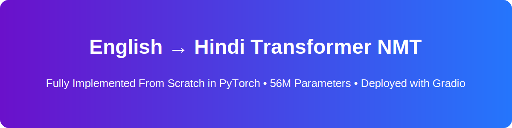

# 🌐 English → Hindi Neural Machine Translation using Transformer Architecture (Built From Scratch)

This project implements a complete English → Hindi Neural Machine Translation (NMT) system using a Transformer model coded entirely from **scratch** in PyTorch.
Every layer, mask, attention mechanism, and training loop was manually implemented **without** using nn.Transformer or pretrained HuggingFace models.

The final model is deployed using a clean Gradio interface on Hugging Face Spaces.

# 🔥 Project Highlights

## Full Transformer Architecture (Manual Implementation)

**Includes custom implementations of:**

* Scaled Dot-Product Attention
* Multi-Head Self Attention
* Multi-Head Cross Attention
* Sinusoidal Positional Encoding
* Residual Connections (Add & Norm)
* Position-wise Feed-Forward Networks
* Encoder stack with N layers
* Decoder stack with N layers
* Look-Ahead Masks
* Padding Masks
* Greedy Autoregressive Decoding

## Training Pipeline Built From Scratch

* SentencePiece tokenization (BPE) for English & Hindi
* Cleaned + preprocessed parallel corpus
* Custom PyTorch Dataset + DataLoader
* Teacher forcing
* Padding-aware CrossEntropy loss
* GPU training on Google Colab

## Web Deployment

* Gradio frontend
* Fully interactive
* Zero local installation required
* Runs directly in browser on Hugging Face Spaces

# 🔢 Model Parameters

## **The Transformer has a total of:**
## **56,436,544 trainable parameters (~56M)**

**Hyperparameters used:**

| Component              | Value             |
| ---------------------- | ----------------- |
| Embedding Dimension    | 512               |
| Attention Heads        | 8                 |
| Encoder Layers         | 6                 |
| Decoder Layers         | 6                 |
| Feed-Forward Dimension | 2048              |
| Tokenizer              | SentencePiece BPE |
| Decoding               | Greedy            |

# 🚀 Live Demo

## You can try the model directly in your browser: https://mohitraje-english-hindi-transformer-nmt.hf.space/

## Hugging Face URL : https://huggingface.co/spaces/Mohitraje/English-Hindi-Transformer-NMT/tree/main

# 🧠 How the Transformer Works (High-Level)

### 1. Token + Positional Embeddings
Converts tokens into dense vectors & injects position information.

### 2. Encoder

Each layer contains:
* Multi-Head Self Attention
* Add & Norm
* Feed-Forward
* Add & Norm

### 3. Decoder

Each layer contains:
* Masked Self-Attention
* Encoder–Decoder Attention
* Feed-Forward
* Add & Norm

### 4. Output Generation

Linear layer → softmax → next-token prediction until <EOS>.

# 📊 Evaluation & Limitations

I was not able to get a stable BLEU score implementation working for this project, so I am not reporting a BLEU value yet. Instead, I monitored training with cross-entropy loss:

- **Training loss:** ~0.05–0.06 (after convergence)
- **Validation loss:** ~0.32

observed overfitting due to limited data and compute

# Acknowledgements

* Attention Is All You Need (Vaswani et al., 2017)  https://proceedings.neurips.cc/paper_files/paper/2017/file/3f5ee243547dee91fbd053c1c4a845aa-Paper.pdf
* PyTorch
* SentencePiece
* Google Colab
* Gradio
* HuggingFace Spaces
